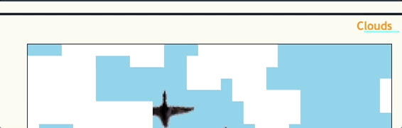
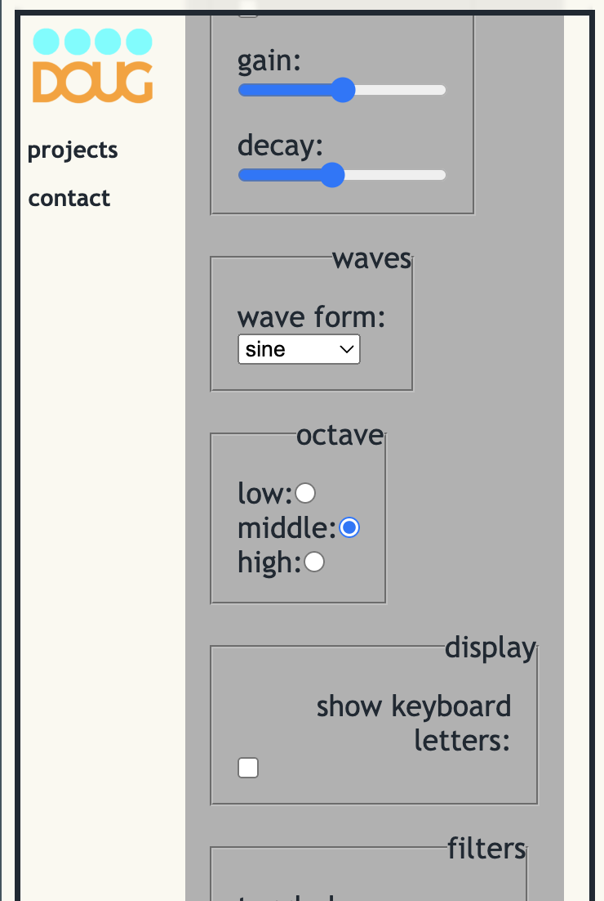
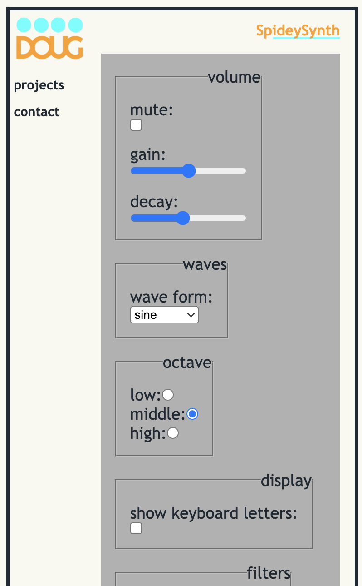
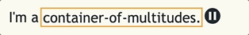
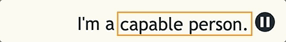
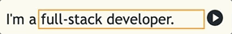

## Hey, I'm Doug
This portfolio is built with a Laravel back-end and a React/Typescript front-end. It uses Inertia.js via a Breeze starter kit. Each page of the portfolio has its own Controller class and corresponding React component. For instance, the Projects controller handles requests by returning Inertia responses, which render React components with project-specific data passed as props. Inertia.js client-side routing allows for a persistent layout without unnecessary re-rendering of static components.

The styling of the layout is preprocessed using Sass. I wanted to keep [global styles](resources/scss/) separate from those of smaller components, and I also wanted to write CSS for the global styles rather than css-in-js. Individual components are styled within their component files via Styled-Components. If a component needed access to a global style var, such as a color, media-query breakpoint, or a padding value, I exported the value in a Sass module ([example](resources/js/Components/FormGroup.tsx)). This allowed me to then use the variable in the Styled-Component declaration.

## Notes About the Layout
The frame around the content is comprised of absolutely positioned psuedo-elements. I wanted to create an effect where Y-overflowed content of the article element would appear to slip beneath the frame as a user scrolled down:

To achieve this, I set the z-index of the pseudo-elements at the top and bottom of the frame higher than that of the article element, and I gave them a blurry backdrop filter. The body and main tags have a height of 100% with overflow: hidden, but the article has overflow-y: scroll, so when the content of the article element is taller than 100%, the main tag does not grow to accommodate it, but the content is scrollable.

## Custom Hooks
There are two custom React hooks at use throughout the portfolio:
### [useScrollOffset](resources/js/Hooks/useScrollOffset.tsx)
When content does overflow, the justify-content property on the article would position the content in the center of the page:

To counter-act this, I needed to add an offset to the top and bottom of the article content. This would allow the page to load with the top of the content visible, and the bottom offset allows for the bottom of the content to sit above the bottom frame when fully scrolled.

To achieve this, using React's [createContext](https://react.dev/reference/react/createContext), I created an article context provider that wraps the article element. In the Article component, I provided the context with the ref to the article tag. I could then access this ref and pass it to the hook from any component nestled within the article context provider. The hook returns a function that calculates the offset amount in pixels by comparing the article's offsetHeight and scrollHeight, and then applies a css variable to the style tag of the body element. The global styles of the layout make use of this variable to apply padding and margin to the necessary elements to achieve the desired effect:

In a useLayoutEffect hook, an eventListener is created on the 'resize' event. I specifically used useLayoutEffect because of the render-blocking quality, as this can help to prevent cumulative layout shift when the offset amount changes on page load or refresh.

### [useDynamicImport](resources/js/Hooks/useDynamicImport.tsx)
This hook imports and renders a React component based on the title passed to the hook. I wanted a way to host some projects as their own React components. When I create a Project resource on the admin side of the portfolio, if the created title matches a component within the Projects subdirectory, the component will be displayed on the project's 'Show' page.

## Home Page
[The home page](resources/js/Pages/Home.tsx) features a rotating marquee that shows different nouns for describing myself:

The list of nouns is dynamic, retrieved from settings on the back-end, and in order to transition the width between nouns of varying length, I needed to set the width with JS, since width: auto cannot be transitioned. The changing of the nouns happens based on an interval. The animation can be paused, which clears the interval:

When the interval is paused, the list of nouns can be scrolled:

When the interval is running, the overflow is hidden, but when the interval is paused, the overflow is set to scroll. Snap points of 1em are applied to the content, as well as a snap-align property of start.

## License

The Laravel framework is open-sourced software licensed under the [MIT license](https://opensource.org/licenses/MIT).
