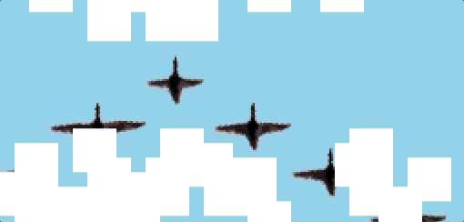
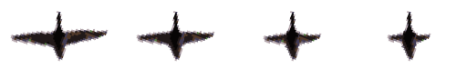

## Clouds Project
This project is a React component comprised of 2 HTML5-Canvases that overlap each other:

You can see it [live on my site](https://dougllittle.com/projects/clouds).

### Cloud Canvas
The top canvas holds procedurally-generated chunks of clouds which blow towards the south east. To achieve this effect, the canvas was divided into a grid of cells with equal height/width, and an array of objects is created to hold the cell coordinates on the canvas, the index of the cells they touch ([using mod math](https://github.com/dl-little/portfolio/blob/a6ce1590b743f19a7783c324c15e55793673910b/resources/js/Components/projects/Canvas/helpers.tsx#L46)), whether the cell is against an edge, and finally, whether the cell should be considered a cloud 'seed'. On initialization of the canvas component, this data is stored in a memo since it's not necessary to recalculate the grid whenever the component is re-rendered, and because the calculations are not dependent on any outside dependency. Another function receives the cells and creates clusters of clouds by storing each seed cell and its neighbors. The clusters and their positions are stored in a piece of state. On each animation frame, a function receives the cluster array and loops through it to paint the coordinates white on the canvas.

An interval is responsible for shifting the clouds down and to the right. The interval ID is stored in a piece of state, which allows us to clear the interval whenever the animation is paused. This interval is the global interval, as clearing it will cease all animation on the page, including the flapping birds. On each tick of the interval, [a function receives the cluster array](https://github.com/dl-little/portfolio/blob/a6ce1590b743f19a7783c324c15e55793673910b/resources/js/Components/projects/Canvas/helpers.tsx#L175) and creates a shallow copy. The copy is looped through, and the coordinates of each cluster is updated. A check is made to determine if the new position would place the cluster off the grid, and if so, the cluster is yanked to the opposite side of the canvas. The functions returns the copy, which is then assigned to the cluster state.

### Bird Canvas
On each animation frame, the bottom canvas draws the blue sky and the birds in v-formation with flapping wings. Each bird in the canvas is one frame of a 4-frame sprite:

The animation is drawn in a useEffect hook that takes the bird sprite and the global animation interval as dependencies. For each bird, an interval is created that will loop through possible frames, incrementing by one until it reaches the final frame, at which point it will start to loop backwards. In this way, the birds wings appear to flap up and down. Initially, I used one interval to control the wings of the birds, but birds don't flap in perfect synchronicity. They're also not made of pixels, but I can pick and choose where I want to be loyal to bird rules. The index of the bird (0-6) is modded by the number of columns in the sprite (4) to determine its starting frame.

To prevent a memory leak due to the introduction of so many intervals, the useEffect hook returns a function that clears each interval. If the global animation is paused, the useEffect hook returns early without creating any intervals.

## Fin?
I showed this project to a friend, and he immediately started jamming his finger on the canvas anticipating some sort of interactivity. Maybe a zen animation of flying birds is too bland for our dopamine-starved frontal lobes, but it also would be sick if you could control the wind direction and speed with a flick of your finger. Or maybe you could re-arrange the sequence of birds by dragging and dropping them. Things to consider for the future.

Overall, this was a fun, quick React project. I'm not much of a pixel-artist, but I'm pretty stoked with how the birds turned out. Thanks for reading.
