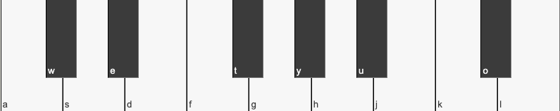
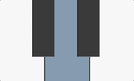
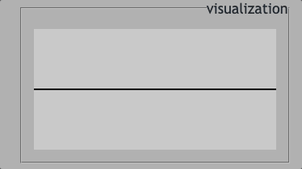

## SpideySynth, because it's on the web
This project is a playable synthesizer built with React that makes use of the [Web Audio API](https://developer.mozilla.org/en-US/docs/Web/API/Web_Audio_API). You can either press each key of the synth manually, or you can use your keyboard to play. See it [live on my site](https://dougllittle.com/projects/spideysynth).

The 'hardware' of the synth is a collection of components. The 'brains' of the synth, where the audio context is created and modified, is created within a custom hook: useAudioContext. The hardware interacts with the brains of the synth via callbacks passed to the control components through a context instance.

### [Synth Context Provider](components/SynthContextProvider.tsx)
The Synth Context Provider is a context instance that stores state and setters for every parameter that the synth needs to make and change sound. The context provider wraps the synth controls and keyboard components.

### Synth Hardware
The hardware is divided into two sections: the controls and the keyboard.

#### Controls
The controls sit above the keyboard and contain settings that modify the sound in various ways, such as volume control, note length, wave form, etc. There is also a control that toggles the appearance of letters on the synth keyboard:

The control inputs are grouped within fieldsets, which is the best way to organize inputs by functionality. The FieldSet component is returned as a memo to prevent unnecessary re-rendering whenever the parent's props change.

In the FieldSet component, we destructure a call to useContext to retrieve all the setters for use in the controls. The callbacks are called in ChangeEventHandlers attached to the control inputs. In this way, when a deeply nested control input modifies a synth parameter, the audio context can adjust the sound accordingly.

#### Synth Keyboard
The keyboard of the synth is a collection of buttons shaped like piano keys. Each synth note can be triggered by its corresponding keyboard key. An event listener in the Synth Context Provider listens for 'keydown' event, and if the pressed key is a trigger for a synth note, that key is added to a collection of 'active keys'. In the Key component, active keys display a different background color for the duration of the press:

### [useAudioContext](./useAudioContext.tsx)
The useAudioContext hook is called in the Synth Context Provider. It receives an object of state values as props, and it returns an object containing the [AudioContext](https://developer.mozilla.org/en-US/docs/Web/API/AudioContext) and an [AnalyserNode](https://developer.mozilla.org/en-US/docs/Web/API/AnalyserNode) for visualization purposes.

The useAudioContext hook creates 4 pieces of state: the AnalyserNode, the Synth's master GainNode, a BiquadFilterNode, and an array of objects that contains data about opened OscillatorNodes. For each key that is pressed on the synth, either manually by clicking on the key button, or by triggering it with a keyboard, an OscillatorNode is created and started. Each OscillatorNode is connected to its own GainNode, which in turn is connected to the context's master GainNode. The individual GainNodes allow the decay control to exponentially dampen the volume of each oscillator rather than the overall volume of the synth. The master volume is controlled via the gain control.

The master GainNode is attached to a BiQuadFilter of type 'lowpass'. If the 'toggle low-pass' control is off, the filter is given a default frequency of 350. With the toggle on, the range slider can control the frequency cutoff for the filter. Frequencies below the set value will be allowed to pass through, and all other frequencies will be attenuated.

The filter is attached to an analyser, and finally the analyser is attached to the Audio Context's destination, which is the device's speakers.

All of the above logic is housed within useEffect hooks that take pieces of the Synth Context's state as dependencies, allowing the audio context to be in sync with input from the user. Performance is considered at every step, so no redundant nodes are created. For instance, there is only one master Gain Node, one BiQuad Filter, and most importantly only one Audio Context. Multiple oscillators are connected with each key press, but as soon as the press is lifted, the oscillators are destroyed.

### Visualization Canvas
The AnalyserNode received from the useAudioContext hook is used to display an "oscilloscope" style visualization of the synth's active frequencies. Calling getByteFrequencyData returns an array of the current frequency, which we can use to draw the waves. 

The canvas ref is provided to the Synth Context Provider in the FieldSet component. On each animation frame, we loop through the frequency data. The x value moves along a set width, and the y value changes based on the frequency of the index. For performance reasons, the requesting of the animation frames is debounced with a timeout. We still have a reactive animation without needing to redraw at an expensive framerate:

### Conclusion
In completing this project, I learned a lot about the following React concepts: Context, memoization and performance optimization. There is a constant flow of data between parent and child components in this project, but by accessing values from the Context Provider, we can avoid passing props too far down the tree. Returning Memos whenever applicable cuts down on the number of renders for children when the parent props change. This synth is set up for easy extendability, as new controls could be plugged into the control json file to be rendered. Connecting new state values and passing them to the useAudioContext hook is all it would take. Some other ideas for controls would be a reverb node, or a highpass filter. Thank you for reading.
